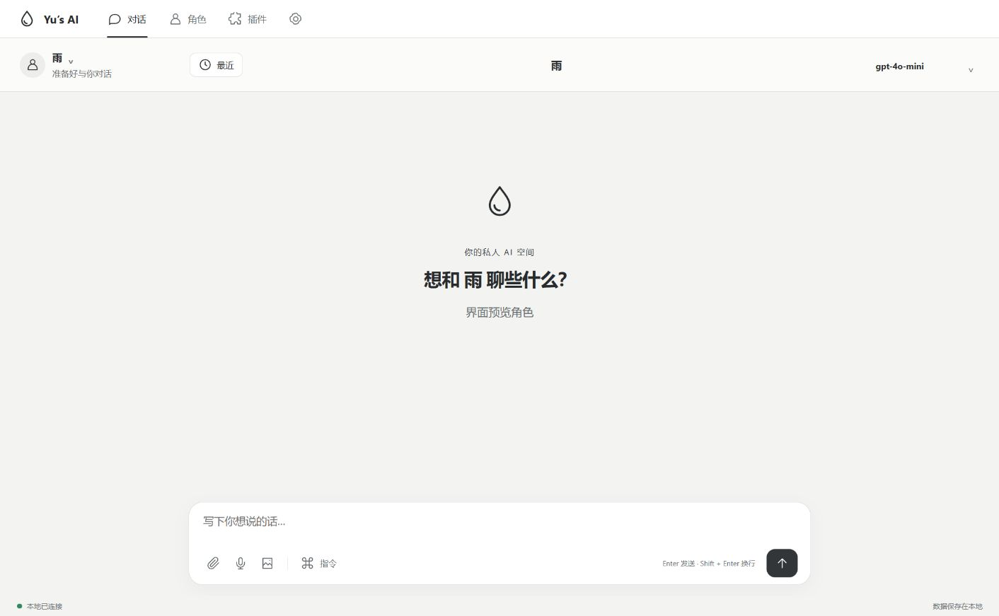
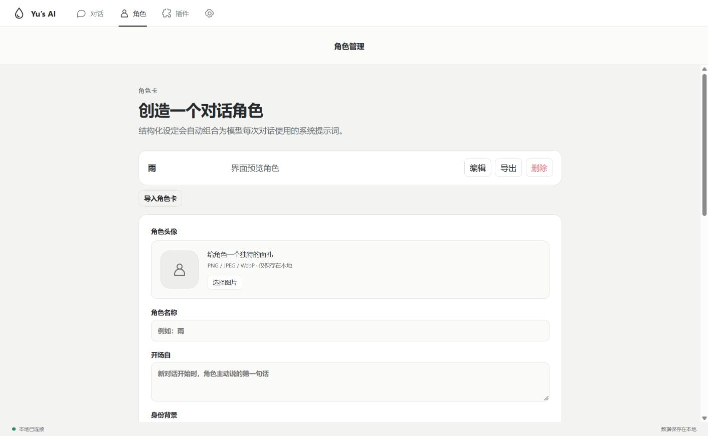
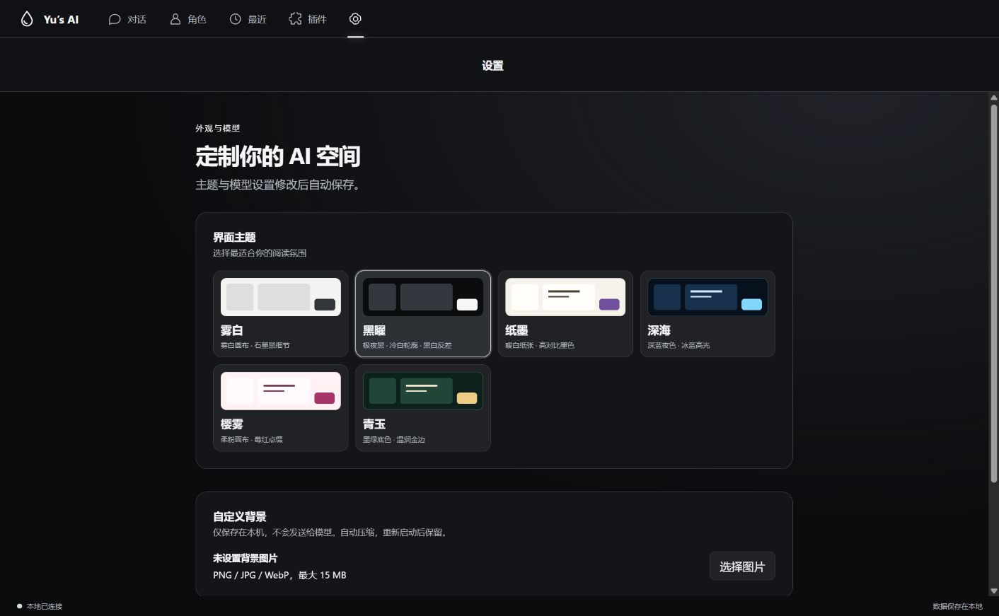
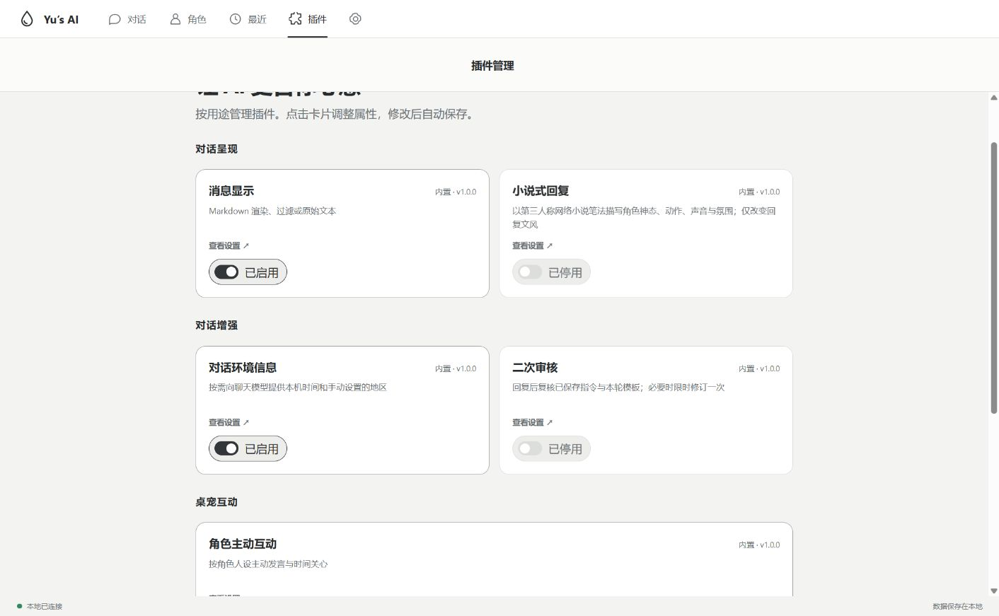
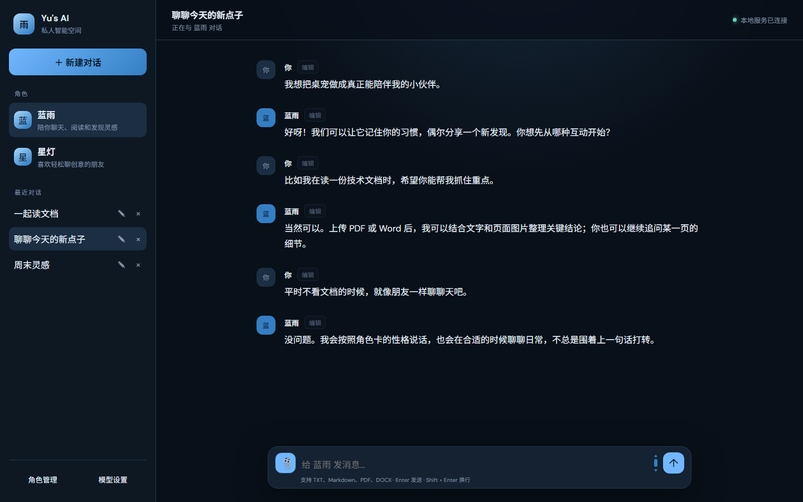

# Yu's AI Plugin Platform


Yu's AI 是一款本地优先的 Windows 私人 AI 聊天软件。它将角色扮演、多模型 API、长期记忆、文档阅读、离线翻译和桌面宠物整合在同一个应用中，并为后续插件能力预留扩展空间。

最新公开安装版：**Windows 0.16.4**（x64）和 **Android 0.1.0 测试版**（ARM64）。两端数据独立保存，不会自动同步。

> ### ⬇ 下载 Windows 安装版
>
> [**下载 Windows 安装程序（x64）**](https://github.com/qtys/Yu-s-Ai-plugin-platform/releases/download/v0.16.4/Yus-AI-0.16.4-x64-setup.exe) · [**下载 Android APK（ARM64 测试版）**](https://github.com/qtys/Yu-s-Ai-plugin-platform/releases/download/v0.15.27/Yus-AI-Mobile-0.1.0-arm64.apk)

无需配置开发环境，下载安装后即可运行。Android 测试版目前仅支持 ARM64 手机；安装前请阅读[手机端数据与调试版升级说明](docs/ANDROID.md)。其他版本、安装包校验值和发布说明可在 [GitHub Releases](https://github.com/qtys/Yu-s-Ai-plugin-platform/releases) 查看。

1. [软件介绍](#一软件介绍)
2. [使用手册](#二使用手册)
3. [功能细节](#三功能细节)
4. [更新日志](#四更新日志)

---

## 一、软件介绍

Yu's AI 面向希望拥有长期陪伴式 AI、角色聊天和桌面助手体验的个人用户。它不是单纯的网页聊天页面，而是带有系统托盘、开机自启、桌宠窗口、本地数据库和离线能力的 Windows 桌面软件。

### 界面预览

0.15.31 使用顶部导航、独立插件页和背景设置，新增绘图窗口与头像选择器。以下截图不含个人数据、API Key 或私有文件。









下图为旧版聊天界面的隔离演示，使用演示角色与对话；不含个人数据、真实 API Key 或私有文件。



### 两位桌面伙伴

<table>
  <tr>
    <th>蓝雨史莱姆</th>
    <th>Q 版爱丽丝</th>
  </tr>
  <tr>
    <td align="center"></td>
    <td align="center"></td>
  </tr>
</table>

封面为项目宣传图；上方聊天图为真实程序的演示数据截图，桌宠图片为程序使用的素材。

### 核心能力

- **私人 AI 对话**：支持 OpenAI Chat Completions 兼容接口、流式回复、多会话、停止生成、消息编辑与撤回。
- **角色扮演**：角色卡可定义身份、背景、性格、说话方式、用户关系、行为边界、开场白和示例对话。
- **记忆系统**：可配置上下文消息数和相关长期记忆条数，较早对话可生成摘要，记忆按角色隔离。
- **可切换桌宠**：提供蓝色雨滴史莱姆和 Q 版爱丽丝两种外观，可拖动、注视鼠标、在桌面移动、显示漫画气泡，并与主界面共享对话记录。
- **模型动作与表情导演**：支持模型根据回复和角色性格编排身体、脸部与头顶水滴动作，并控制眼睛、嘴巴、腮红和视线；主动发言也会生成对应表情。OpenAI、DeepSeek 官方接口可使用 Function Calling，其他兼容接口采用隐藏标签。
- **文档阅读**：可在聊天中上传 TXT、Markdown、PDF、DOCX，支持长文档以及 PDF/DOCX 图片分析。
- **离线翻译**：基于 Argos Translate 提供中英双向翻译和跨应用连续翻译。
- **主动互动**：角色可结合人设、时间段和可选新闻源主动发起话题；支持随机触发、时间关心及关心概率调节。
- **按需看屏幕**：桌宠可读取当前鼠标所在显示器的一帧并用视觉模型描述；可单独允许主动发言参考画面，默认均关闭。
- **个性化界面**：顶部导航与独立插件页；提供雾白、黑曜、纸墨、深海、樱雾、青玉六套主题，支持自定义背景图片，以及 Markdown 渲染、过滤和原始文本模式。
- **语音输入与朗读**：在模型配置页连接 OpenAI 格式的识别与合成 API，支持录音转写确认、回复朗读与取消，不自动复用聊天密钥。
- **图片生成**：模型配置页的绘图模型支持 Images API 兼容接口，独立配置或复用连接，手动生成、预览和保存 PNG；不自动上传聊天记录或角色卡。
- **本地优先**：角色、会话、设置、记忆、语言包及日志主要保存在软件安装目录。

### 适用场景

- 创建具有稳定人设、长期记忆和独立说话方式的私人 AI 角色。
- 让桌宠常驻桌面，随时打开聊天、翻译或设置。
- 阅读技术文档、Word、PDF 和硬件原理图。
- 使用 DeepSeek 或其他 OpenAI 兼容模型服务，并自行控制模型参数。
- 在不上传文本到翻译服务的情况下进行本地中英翻译。

> Yu's AI 本身不提供模型额度。在线模型的费用与限制由所配置的服务商决定。

---

## 二、使用手册

### 2.1 安装与首次启动

项目提供 Windows NSIS 安装包和 Android ARM64 测试 APK。自行构建后的 Windows 安装包位于：

```text
frontend\src-tauri\target\release\bundle\nsis\Yus AI_<版本号>_x64-setup.exe
```

安装后直接启动 **Yus AI**，不需要手动启动后端。首次使用建议：

1. 从系统托盘打开主界面。
2. 创建角色，或导入 JSON 角色卡。
3. 从顶部“设置”进入“模型连接”，填写 API 地址、API Key 和模型名称。
4. 设置最大输出长度、上下文长度和文档图片模型。
5. 设置自动保存；选择角色，创建新对话并发送消息。

关闭主窗口只会切换回桌宠模式。需要结束全部进程时，请在系统托盘右键菜单中选择“退出”。

### 2.2 配置模型

“设置”中的模型连接区域可保存多个模型配置，每条分别记录名称、API 地址、API Key、模型名称和可选的视觉模型；支持添加、切换、重命名、编辑与删除。在聊天窗口顶部也可快速切换当前连接；桌宠、主动发言、文档与屏幕分析使用同一个当前连接。温度、最大输出长度、最近上下文消息数（2–200）、相关记忆条数（0–50）等选项为全局设置。所有设置修改后自动保存，不再需要点击“保存设置”；切换配置前会先保存当前修改。至少保留一个配置。

在顶部“插件”→“对话增强”中点击“对话环境信息”卡片，可以分别打开“提供当前设备本地时间”和“向模型提供位置/地区”。插件默认启用、时间开关默认开启、位置开关默认关闭。关闭插件会停止向聊天模型提供两项信息，但不会清除地区输入或子开关；位置不会自动读取 GPS。桌宠聊天沿用同一设置，主动发言的时间调度不受影响。

模型连接保留在“设置”的抽屉中；插件管理拥有独立页面，从顶部“插件”进入，按用途分类，点击卡片打开属性弹窗，开关与属性修改自动保存。视觉模型可从已保存的模型配置中选择，会使用该配置的接口地址与密钥。

### 2.2.1 界面主题与背景

顶部导航提供对话、角色、插件和设置入口。最近对话位于聊天标题栏的角色选择右侧，支持搜索、新建、重命名和删除；新对话统一在最近对话中创建，聊天页不再常驻侧栏。

在“设置”选择雾白、黑曜、纸墨、深海、樱雾或青玉主题。“黑曜”采用深黑背景、冷白按钮与细线轮廓。自定义背景支持 PNG、JPG、WebP（不超过 15 MB），自动压缩至最长边 1600 像素，可更换、清除并调整 10%–70% 的可见度；文字区域保留阅读底色。背景只保存在本机桌面偏好中，不发送给模型，重新启动后保留。旧主题选择会兼容映射。

模型配置页顶部按对话模型、语音模型、绘图模型切换：默认显示对话配置，其余配置按需打开，不再将长表单堆叠。语音功能在“模型配置”→“语音模型”启用并配置，详细说明见 [在线语音输入与朗读](docs/SPEECH_API.md)。

图片生成在“模型配置”→“绘图模型”启用，填写绘图 API 地址、密钥和模型名称，也可复用现有连接的地址与密钥。启用后点击输入框旁的绘图图标，本次发送的文字直接作为绘图描述，结果显示在当前对话中；成功后自动回到聊天模式，失败保留描述供修改重试。不会自动提交历史、角色卡或附件。已有消息旁的「生成图片」仍支持选中文字和补充绘图指令。不同模型支持的尺寸、质量和返回格式不同；生成可能收费，失败不自动重试。作品文件保存在安装目录 `data/generated-images` 中，随备份一起恢复。详见 [图片生成配置与使用](docs/image-generation.md)。

每条已保存消息旁提供“编辑”和“撤回”。撤回自己的消息时会同时移除这一轮 AI 回复，后续轮次保留；AI 回复可单独撤回。操作前确认，生成期间暂不可撤回；关联自动记忆和摘要同步清理，手动保存的指令保留，桌宠同步刷新。撤回不可恢复，输入框为空时会放回撤回的用户原文，便于修改重发。

同一区域的“二次审核”插件默认关闭，聊天会更快结束；已保存指令和本轮模板仍会在生成前交给模型。开启后，程序在回复完成时检查明确指令，必要时最多流式修订一次；审核与修订共用 30 秒时限，超时保留原回复。展开聊天和桌宠对话框会显示正在审核或修订的状态。

Yu's AI 使用 OpenAI Chat Completions 兼容格式，可连接 DeepSeek 等兼容服务。接口地址、模型名或代理配置错误时，日志中会记录连接失败或服务端错误。

### 2.3 创建角色并聊天

1. 打开“角色管理”。
2. 填写名称、头像、身份背景、性格、说话方式、关系、边界和示例对话。
3. 保存角色并返回主界面。
4. 在侧栏“最近对话”中点击“新建对话”；`Enter` 发送，`Shift + Enter` 换行。角色列表中的“创建角色”卡片可新增角色卡。
5. 最近对话支持重命名和删除。

删除对话会同时移除该对话的消息、附件和由这些消息生成的自动记忆；同角色其他对话的记忆，以及明确保存的角色通用指令，不受影响。新建对话不会继承旧对话的消息或附件。

用户消息与 AI 回复都可以修改。下一次请求会使用修改后的内容，并重新处理受影响的摘要和记忆。

0.15.19 起的源码新增“对话指令库”：点击输入框旁的“指”，可保存需要长期遵循的要求，并选择作用于该角色的所有对话或仅当前对话；支持编辑、停用和删除。也可以在自己的消息旁点击“存为指令”，确认内容后再保存。普通聊天不会自动成为指令；当前消息如明确改变旧偏好，本轮要求优先。该功能已包含在当前 Windows 公开安装版。

0.15.21 起的源码新增“提示词模板”：在输入框旁点击“指”，切换到“提示词模板”，即可导入本地 `.txt`／`.md` 文件或自行创建模板。模板中的 `{{主题}}` 一类占位符会变成输入框；填写后先预览最终文本，再选择“仅下一次回复”“当前对话持续生效”或“当前角色所有对话”。长期启用的模板会出现在“生效的指令”中，可独立停用、编辑或删除。仅本次模板在下一条消息成功提交后自动取消，不进入后续对话。模板只作为文本保存，不执行其中的代码或命令。该功能已包含在当前 Windows 公开安装版。

0.15.23 起的源码新增“小说式回复”插件：在展开界面顶部“插件”中开启。开启后，展开聊天与桌宠聊天会尝试用第三人称网络小说笔法回复，适度描写角色外貌、动作、声音、神态和氛围，并使用自然的修辞；不会重写旧消息或额外调用模型。该插件默认关闭，关闭后后续回复恢复普通风格。角色卡、用户当前要求和已保存指令优先于插件文风；主动发言暂不受影响。该功能已包含在当前 Windows 公开安装版。

### 2.3.1 酒馆角色卡与角色扮演插件（电脑端，开发版）

电脑端导航调整为「对话 / 模型配置 / 插件 / 设置」。模型接口、视觉模型、上下文和输出参数独立到模型配置页；外观、背景和备份留在设置页。

角色卡与角色扮演合并为一个插件：从「插件 → 角色卡与角色扮演」管理角色、导入卡片并选择「使用角色」。创建表单和酒馆高级设置默认收起；角色的场景和补充规则仅在编辑角色卡时填写，独立自动保存。新角色先保存，再编辑这些可选字段。

关闭此插件后，电脑端及桌宠切换独立普通聊天记录，无需创建角色，不注入角色设定、世界书、角色记忆、角色保存指令或首轮初始化。角色主动发言同时暂停；其他已启用插件继续按各自开关工作。原角色和聊天不删除，重新启用后可继续使用。Android 端暂维持原结构。

在「角色」页导入酒馆 PNG / JSON 卡，确认兼容性提示后创建角色。普通 PNG 图片不包含角色卡元数据，不能作为酒馆卡导入。原来的 Yu's AI JSON 卡仍可使用。

需要高级兼容时，在角色插件页展开「酒馆资源与高级设置」，选择要配置的角色：

1. 选择内置预设，或在预设库导入酒馆 **Chat Completion JSON**；预设按角色绑定，不按角色名字猜测匹配。
2. 可复制内置预设，再编辑提示词、启停和排列顺序；`chatHistory` 必须保留。修改自动保存；共享同一自定义预设的角色会一起使用其更新。
3. 编辑用户称呼、人设、场景及历史后置指令；可选择备用开场白供下一次新会话使用。主提示词及示例对白在角色卡中编辑。
4. 世界书可使用卡片内嵌内容，或导入独立 World Info JSON。按当前会话关键词激活；配置扫描消息数和 token 估算预算，避免整本世界书每轮重复发送。
5. 等待「已自动保存」，在请求检查中预览组装；发送一次真实对话后，可查看最近实际主请求，包括其他已启用插件加入的消息。预览本身不调用模型。

支持 `{{char}}`、`{{user}}`、`{{description}}`、`{{personality}}`、`{{scenario}}`、`{{persona}}`；卡片主提示词和后置指令支持 `{{original}}` 引用预设原文。示例对白使用 `<START>` 分段和 `{{user}}:` / `{{char}}:` 标签。角色扮演提供持续设定，小说插件提供文风，首轮初始化只执行一次，三者互不代替。

复杂预设最多支持 500 段（文件上限仍为 1.5 MB）。导入前先显示逐模块兼容诊断，再确认保存；已导入预设也可点击「兼容诊断」。支持单次请求内的 `setvar/getvar/addvar/incvar/decvar/hasvar/deletevar`、嵌套参数、`random`、简单 `roll` 和 `lastusermessage`。变量按启用模块的顺序求值，每次请求重新初始化，不在角色之间共享；世界书条目的变量独立。随机结果在预览和真实请求中可能不同，token 显示仅为估算。

含未知宏/占位符的模块整段跳过并给出警告，不将未展开的模板悄悄发送给模型。全局变量、作用域块、条件块、变量简写、`pick`、时间宏及扩展宏尚不支持；不会通过宏绕过环境信息开关。请求预览 / 实际快照中的 `diagnostics` 可检查模块是否已发送、禁用、不兼容或只初始化变量。实现参考 [酒馆宏文档](https://docs.sillytavern.app/usage/core-concepts/macros/)，属于有限兼容子集，不是完整酒馆运行环境。

原生角色卡导出保留酒馆元数据和本角色配置，不含聊天、模型密钥或请求快照；自定义预设需另外导出。酒馆 JSON 导出在角色扮演设置中，安装版将预设、世界书及酒馆卡保存到安装目录的 `data/roleplay-exports/`，原生卡仍保存到 `data/character-exports/`。未知扩展字段保留，但不会运行脚本、正则、递归扫描、绝对深度注入、群组机制或第三方扩展。导入预设的模型连接和采样参数不覆盖本机模型设置；不保证所有酒馆预设等效执行。数据格式依据 [V2 角色卡规范](https://github.com/malfoyslastname/character-card-spec-v2) 和 [酒馆 Prompt Manager 文档](https://docs.sillytavern.app/usage/prompts/prompt-manager/)，适配实现不引入酒馆源码。

> 实际请求快照会包含当前对话内容，存于本机数据库并随完整数据备份；请勿公开数据库或预览文本。日志只记录条数和 ID，不记录角色卡及请求正文。手机端暂未同步此插件。

### 2.4 使用桌宠

- 单击桌宠：显示正下方的轻量聊天输入框；再次单击收起。
- 按住桌宠主体移动鼠标：拖动桌宠。
- 右键桌宠：展开或收起插件功能圈，不再恢复上一次面板；左键单击可收起已展开的功能圈。
- 点击功能圈：打开对话、翻译、设置等功能。
- 回复来自同一轮聊天，按完整句子逐个冒泡，新句子顶起旧句子，最多保留四个；完整展示后预留阅读时间再淡出，鼠标停在气泡上暂停消失。完整内容仍保存在原对话中。
- 桌宠使用独立的简短、自然回复提示；不影响展开界面，用户明确保存的指令仍优先。翻译与设置仍使用独立面板及关闭按钮。
- “设置”功能圈：调整桌宠大小、透明度、字体和气泡尺寸。
- 在桌宠设置顶部可切换蓝雨史莱姆和 Q 版爱丽丝；选择会保存到本机，重启后继续使用。两种外观共享角色、对话和功能。
- “回复驱动”：允许模型根据回复情绪控制表情、视线、动作、特效和有限的桌面移动；“灵动强度”可控制动作幅度。
- “创意试演”：无需发送消息即可预览身体、脸部和头顶水滴组成的分层动作。
- “动作调试”：查看动作来源、优先级、关键帧、完成度、程序补全层和模型原始动作参数。
- 桌宠输入区域只保留输入框与发送，语音输入和朗读请在展开界面使用；聊天气泡按内容自然增高，不使用内部滚动条。屏幕空间不足时优先移除较早气泡。
- 桌宠采用独立透明聊天窗口，打开输入和回复气泡不改变桌宠本体位置及窗口尺寸；聊天跟随桌宠拖动。0.16.0 本地版逐条优先放在上方，只有会越界的气泡贴近左侧显示，左侧不足再使用右侧。透明间隙可点击后方应用。
- 屏幕读取仍需在模型设置中授权，并使用支持图片输入的视觉模型；主动发言可按插件开关结合屏幕。纯输入模式不再显示“看屏幕”等附加按钮。
- 系统托盘：显示/隐藏主界面或桌宠，以及完全退出程序。

位置、大小、透明度和气泡尺寸会保存到本地数据库。主界面和桌宠共用当前角色、会话及消息记录。

### 2.5 上传并分析文档

1. 在聊天输入框点击回形针按钮。
2. 选择 TXT、Markdown、PDF 或 DOCX 文件。
3. 等待附件卡片显示读取、分页分析和全文汇总进度。
4. 分析完成后，直接在当前对话中询问文档内容。
5. 不再需要时，可删除附件及其本地索引。

在“模型设置 → 文档分析模式”中可选择：

- **快速分析**：读取文本和整页预览，速度较快、图片 token 消耗较低。
- **深度分析**：额外读取 PDF 页面四象限高清切片，适合原理图和细节密集资料。

模型需要支持图片输入才能分析页面图像。文档图片模型与普通聊天模型可以分别设置。

### 2.6 使用离线翻译

1. 从桌宠功能圈打开“翻译”。
2. 首次使用时下载中译英和英译中语言包。
3. 下载完成后输入文本即可离线翻译。
4. 开启“连续翻译”后，在其他应用中选中文本，译文会自动显示在桌宠气泡中。

选择翻译框自身文字不会再次触发翻译。关闭翻译框、隐藏桌宠或返回主界面时，连续翻译会停止。

语言包下载支持测速、进度显示、`.part` 断点续传、失败重试和自动换源，也可配置可信的镜像基础地址。

### 2.7 消息显示模式

- **Markdown 渲染**：显示标题、列表、表格、引用和代码块。
- **Markdown 过滤**：移除常见 Markdown 标记，只显示纯文本。
- **原始文本**：显示模型返回的原始内容，适合调试。

### 2.8 主动互动

在“模型设置”启用角色主动互动后，可以设置固定间隔或随机时间区间、承接最近聊天的概率（0%–50%，默认 15%）、时间关心开关及概率、输出 token 上限、近期 RSS 新闻、时间感知和角色台词。

“主动发言结合当前屏幕”需另外开启屏幕读取权限并使用支持图片输入的模型。只有主动发言到期时才抓取一帧；视觉模型先生成简短画面摘要，角色可以自然结合但不会被要求每次都提到屏幕。识别失败时继续普通主动发言。

主动发言会遵循角色卡，默认不会作为后续聊天的模型上下文上传。若点击该发言气泡里的“聊聊这个话题”，下一次提问会明确带上这条发言供模型接续。早晨、午间、下午、晚间和临睡前可随机触发符合当前时间的自然关心；同一时间窗口每天最多一次，且不会武断地认定用户没吃饭、生病或正在工作。只有抽中“承接最近聊天”时，才会向主动模型提供最近两条消息作为轻微线索；其他时候完全不发送聊天历史，而是按人设随机聊日常、兴趣、轻松话题或可选时事。主动发言全天按设定频率触发，不设置夜间禁用；用户正在聊天时暂停，失败时不显示打扰性提示，只写入日志。

### 2.9 开机自启与单实例

- 可从模型设置或托盘菜单开关 Windows 开机自启。
- 开机启动后进入桌宠模式，并恢复上次保存位置。
- 重复点击快捷方式不会启动第二个后端或托盘图标。
- 启动项位于当前用户的 `HKEY_CURRENT_USER\Software\Microsoft\Windows\CurrentVersion\Run`，无需管理员权限。
- 覆盖升级会保留自启选择，并在安装路径变化时修正路径。

### 2.10 应用内更新

在“模型设置 → 更新与数据安全”中点击“检查更新”。软件会读取本仓库最新的 GitHub Release，并显示版本号、发布说明和安装包大小。短时间内重复检查会复用结果，下载也会沿用已经验证的发布信息，避免重复请求触发 GitHub API 限流；GitHub API 不可用时自动切换到官方 Release 页面，并重试暂时的连接失败。

下载支持进度显示、失败重试和 `.part` 断点续传；服务器返回的续传起点也会核对，避免拼接错误。下载完成后必须通过 GitHub Release 资源提供的 SHA-256 摘要校验，校验成功才允许启动安装程序；下载地址也必须属于本项目的 GitHub Release。安装前程序会正常关闭本地服务，安装目录中的数据库不会被删除。

更新采用手动确认方式，不会静默下载或在后台自动安装。新版本启动并成功连接本地服务后，会自动删除安装目录 `data/updates` 中当前版本及更早版本的完整安装包；较新版本安装包和用于断点续传的 `.part` 文件会保留。若启动或清理失败，下次启动会重试。

### 2.11 数据备份与恢复

“创建备份”会先使用 SQLite Backup API 生成一致性数据库快照，再把数据库、上传文档、角色导出和桌面偏好写入 `.yus-backup`。备份包括角色、聊天、长期记忆、模型设置、API Key、主动互动配置、桌宠位置、主题、桌宠大小/透明度、气泡尺寸及文档索引，不包含日志、临时文件和可重新下载的翻译语言包。

恢复时会检查 ZIP 路径安全、备份格式、数据库完整性和外键关系。替换当前数据前，软件会自动在安装目录创建一份 `Yus-AI-pre-restore-*.yus-backup` 安全快照；恢复完成后自动重启。

> 备份包含 API Key 和私人聊天内容。请存放在可信位置，不要上传到公开仓库或公共网盘。

### 2.12 Android 测试版

仓库中的 `frontend/mobile-native/` 是独立 Android 工程，提供 [0.1.0 ARM64 测试 APK](https://github.com/qtys/Yu-s-Ai-plugin-platform/releases/download/v0.15.27/Yus-AI-Mobile-0.1.0-arm64.apk)。它不需要电脑后端常驻，可在手机本地保存角色、对话、指令、模板与模型配置，并直接连接用户自行配置的 HTTPS 模型接口。模型密钥保存在应用私有目录；桌面与手机数据不会自动同步，卸载应用可能删除手机本地数据。此前通过 USB 安装的调试包采用不同签名，**不能直接覆盖安装正式签名的测试包**；请先保留调试包和其中的数据，详见 [Android 说明](docs/ANDROID.md)。

聊天页把主要空间留给消息：在“角色”页切换角色，在“最近”页新建对话，输入框右侧可打开指令与模板。键盘弹出时输入区保持在键盘上方，底部导航暂时隐藏。手机端已适配消息显示、时间信息和小说式回复；桌宠、离线翻译、主动互动、二次审核、文档分析与桌面的完整记忆系统仍待适配。构建与 USB 调试步骤见 [Android 开发说明](docs/ANDROID.md)。

---

## 三、功能细节

### 3.1 对话、角色与记忆

- 支持流式回复、停止生成、多角色、多会话和本地历史记录。
- 普通回复达到单轮输出限制时自动续写并合并，最多自动续写 3 次。
- 角色卡支持 JSON 导入导出，结构化字段自动生成系统提示词。
- 长对话保留较早内容摘要，并根据当前话题选择相关长期记忆。
- 指令库与普通记忆分开存储；重复提问时会参考先前的答复，尽量补充新角度而不改变事实。
- 姓名、偏好等记忆按角色隔离。

### 3.2 文档分析机制

- 附件和当前对话绑定，原文件、解析结果和索引保存在安装目录。
- 长文档先分段分析，再生成部分摘要和全文总览。
- 提问时发送全文总览和相关原文片段，PDF 引用保留页码。
- DOCX 内嵌图片会一并处理；PDF 可渲染整页预览和四象限高清切片。
- `SCH_`、`SCHEMATIC` 文件自动采用硬件原理图提示。
- 图片分析没有应用侧累计 token 上限，但仍受服务商上下文、额度和计费限制。

### 3.3 桌宠交互

- 蓝色史莱姆窗口透明、无边框、始终置顶。
- 五个功能圈从正下方开始沿 180° 半圆等距排列。
- 桌宠拆分为身体、脸部、头顶水滴、高光和地面阴影，可分别运动，不再依赖整张动作贴图。
- 全局鼠标视线不要求鼠标靠近桌宠；模型也可以选择看向指定方向或暂时不看鼠标。
- 支持挤压、水波、回弹、边缘吸附、待机、犯困、前后空翻和受屏幕边界约束的自主移动。
- 模型回复可驱动眼睛、嘴型、腮红、视线、身体形变、脸部延迟反应、水滴惯性以及爱心、星光、问号、汗滴和音符等特效。
- 自定义动作支持身体、脸部和水滴三组关键帧；缺少分层参数时，程序会根据身体重心与惯性安全补全，并计算动作完成度。
- 最近五次模型表演会用于动作去重，减少连续使用同一种构思；用户拖动、聊天等待、模型回复和主动互动按优先级调度，避免动作互相打断。
- OpenAI 与 DeepSeek 官方接口优先使用 `perform_pet_action` Function Calling；其他 OpenAI 兼容接口自动回退到隐藏动作标签。
- 气泡根据屏幕边界调整，保持靠近桌宠并避免重叠或越界。
- 隐藏气泡不会拦截后方桌面点击。
- 气泡宽高可拖动或精确设置；点击判定区贴近史莱姆可见主体。

桌宠设置中的“动作调试”会显示模型动作来源、三层关键帧数量、情绪特效、剩余时间、动作完成度和程序自动补全层，方便调整提示词或排查模型兼容性。

### 3.4 本地数据与隐私

桌面版数据保存在安装目录，覆盖安装或升级时不会删除：

```text
<安装目录>\data\yus_ai.db
<安装目录>\data\translation-models\
<安装目录>\data\character-exports\
<安装目录>\data\temp\
<安装目录>\data\backups\
<安装目录>\data\updates\
<安装目录>\logs\
```

- `yus_ai.db`：角色、会话、消息、设置、桌宠位置和记忆。
- `translation-models`：离线翻译语言包。
- `character-exports`：导出的角色卡。
- `backups`：应用内创建的备份及恢复前安全快照。
- `updates`：已下载并通过摘要校验的安装程序；未完成下载使用 `.part` 文件。
- `logs`：运行日志和诊断信息。

首次运行新版时，如安装目录没有数据库，程序会尝试复制旧版用户数据并保留旧文件。日志不会记录 API Key、Authorization Header、聊天正文或系统提示词。

屏幕读取默认关闭。启用后截图仅在内存中压缩并发送到用户配置的视觉模型服务，不保存原图到安装目录、数据库或日志；视觉摘要不会自动写入聊天记录。若画面上有密码、私密消息等信息，请先关闭屏幕读取或遮挡敏感区域。该功能会产生额外的视觉模型 token 费用。

API Key 当前保存在 SQLite，尚未接入 Windows Credential Manager，请勿把 `data`、`logs` 或本机配置上传到公开仓库。

从 0.13.3 开始，`yus-ai-backend.exe` 必须和 `backend-runtime` 配套使用。后端临时文件写入 `data/temp`，不再每次向 C 盘解压大型 `_MEI` 运行库。

旧版临时运行库清理脚本默认只预览：

```powershell
.\scripts\clean-legacy-backend-temp.ps1 -TempDirectory 'C:\Users\<用户名>\AppData\Local\Temp' -InstallDirectory 'D:\Apps\Yus AI'
```

### 3.5 日志与调试

日志生成在 `<安装目录>\logs\`，记录后端启动、API 请求、模型连接、文档分析、语言包下载和异常信息。模型动作会记录 `pet_motion_selected`，其中包括工具/标签模式、动作名、身体/脸部/水滴关键帧数量、特效、完成度和程序补全层，但不会写入聊天正文。接口说明见[调试接口](docs/DEBUG_API.md)。

### 3.6 当前限制与已知问题

- Android 版为首个公开测试包，仅支持 ARM64；桌宠、离线翻译、文档分析等桌面功能尚未移植。
- 本地后端固定监听 `127.0.0.1:8000`。
- API Key 暂时以本地数据库形式保存。
- 通用第三方插件系统仍在建设。
- 连续翻译依赖目标应用支持标准 `Ctrl+C`，部分管理员或受保护窗口无法读取选区。
- Windows 和 WebView 仍可能使用 C 盘系统缓存。
- 部分设备从桌宠模式展开主窗口后，第一次按住原生标题栏准备拖动时仍可能短暂卡顿；该问题尚在排查，不影响后续拖动。

### 3.7 本地开发与构建

环境：Windows 10/11、Node.js 20+、Python 3.10+、Rust 和 Tauri 2 Windows 开发环境。

启动后端：

```powershell
python -m venv .venv
.\.venv\Scripts\python -m pip install -r backend\requirements.txt
cd backend
..\.venv\Scripts\python -m uvicorn app.main:app --reload
```

启动网页调试界面：

```powershell
cd frontend
npm install
npm run dev
```

网页模式不包含完整的桌宠、托盘和原生文件能力。

构建桌面应用：

```powershell
.\.venv\Scripts\python -m pip install -r backend\requirements-build.txt
.\scripts\build-backend.ps1
cd frontend
npm run desktop:dev
```

生成安装包：

```powershell
.\scripts\build-backend.ps1
cd frontend
npm run desktop:build
```

版本规则：从 `0.15.1` 起，每次对外更新默认将补丁版本递增 `0.0.1`（例如 `0.15.1 → 0.15.2`），并同步修改后端版本、Tauri 配置、Cargo 包版本、README、CHANGELOG、Git 标签和 Release 安装包名称。

测试：

```powershell
cd frontend
npm run build

cd ..\backend
..\.venv\Scripts\python -m pytest -q
```

项目文档：

- [MVP 规格](docs/MVP.md)
- [项目进度](docs/PROGRESS.md)
- [完整修改记录](CHANGELOG.md)
- [架构说明](docs/ARCHITECTURE.md)
- [内置插件框架（开发中）](docs/PLUGINS.md)
- [调试接口](docs/DEBUG_API.md)
- [Android 调试版构建与隐私说明](docs/ANDROID.md)

---

## 四、更新日志

### 未发布：电脑端角色扮演插件（2026-10-11）

- 支持酒馆 V2 PNG / JSON 卡、Chat Completion 预设与基础关键词世界书，提供按角色绑定、自动保存和元数据保留。
- 提示词分段排序、常用宏、示例对白、历史后置指令独立组装；与小说文风、首轮初始化共存。
- 提供角色扮演层预览和最近实际请求检查；仅电脑端，不执行导入卡片中的脚本或高级扩展。

完整记录见 [CHANGELOG.md](CHANGELOG.md)。

### Android 0.1.2（2026-10-10，本地构建）

- 长按对话消息，或点击消息旁的「···」，可编辑或撤回。编辑后下一轮模型请求使用修改后的内容；已有回复不会自动重新生成。
- 撤回用户消息会删除该轮 AI 回复，其他轮次保留；撤回 AI 回复仅删除该条。确认后生效，空输入框会放回撤回的用户原文。
- 模型正在回复时不可修改消息；失败发送留下的记录也可处理。不删除长期指令，不重置首轮状态，不影响其他对话。覆盖安装保留手机数据。

### 0.16.4（2026-10-11，Windows x64）

- 角色卡与角色扮演整合为插件，关闭后使用独立的自由对话；支持酒馆角色卡、预设与基础世界书。
- 模型配置统一对话、语音、绘图三类，保留原有配置；绘图使用输入框单次技能，结果加入当前对话。
- 全局导航、欢迎页、输入框和全部插件设置统一为轻量主题样式，复杂选项按需展开。
- 安装包与源码同步发布到 GitHub Releases；此前 0.16.0–0.16.3 的本地迭代一并包含在本版中。

### 0.16.3（2026-10-10，Windows x64，本地构建，尚未公开发布）

- 在「角色 → 编辑 / 创建角色 → 首轮角色初始化」启用首轮指令，选择软件自带的公共模板或手动编辑，保存角色后创建新对话测试。内置模板不依赖私人指令库，所有安装用户均可使用。
- 内置「沉浸式角色开篇」保留角色代入、动作与情绪等细节描写、按题材调整语言，首轮以“开始续写”开头；另外提供自然角色互动、小说场景开篇与日常陪伴开场。此功能不承诺绕过模型服务限制，不会打包个人原始指令。
- 可另存为本机自定义模板、编辑 / 删除自己的模板，或恢复内置原文。角色使用独立副本，修改模板不会悄悄改变其他角色；自定义内容不进入安装包。支持填写 `{{变量}}`，`{{角色名称}}` 在发送时自动填入。
- 每个新对话独立执行一次，开场白不计数；失败、中断或最终仍截断时可重试。首次完整回复保存后不再发送首轮指令，界面显示执行状态；已有对话升级后不会被重新初始化。首轮回复仍可能通过聊天历史影响后续回答。
- 首轮配置随角色卡导入导出，模板和执行状态保存在本地数据库并随数据备份保留。默认关闭，未打包用户私人指令或个人“破限”模板原文。
- Android 0.1.1：在「角色 → 首轮配置」启用并选择相同的四个内置模板，保存后从「最近」新建对话测试。手机模板与执行状态保存在本机，覆盖安装不清空既有记录；旧对话不补执行，输出截断或中断不消耗首轮机会。此处不依赖电脑后端。

### 0.16.2（2026-10-10，Windows x64，本地构建，尚未公开发布）

- 「插件 → 小说式回复」弹窗可设置自然文风、人物动机、情节连贯与轻量/适中/丰富描写，修改自动保存。只发送启用的精简规则，不反复上传完整 Markdown 文档；桌宠保持简短气泡。
- 可编辑硬性禁词（每行一条）和禁用对照句式。开启时按句检查后显示；命中才额外调用一次改写，最多等待 30 秒，失败不展示、不保存违规回复。关闭恢复即时流式显示；代码、网址和用户原文引用保留。
- 配置保存在安装目录的数据库，随数据备份保留；插件事件记录于 `logs/plugins/novel_reply.log`。文风原则参考 [角色扮演创作系统 v1.74](https://github.com/nmbzth/roleplay_system_v1.74_bundle)，使用原创精简规则，不整份内置原预设。

### 0.16.1（2026-10-09，Windows x64，本地构建，尚未公开发布）

- 蓝雨史莱姆可根据轻触位置表现不同反应，连续轻戳有短暂“小意见”，并保留数秒表情余韵；模型情绪优先，拖动不计为逗弄，不额外消耗 token。
- 蓝雨史莱姆增加局部触碰变形、五官分层跟随和头顶水滴惯性；保留现有外观与模型动作，稳定后停止动画计算。
- 主动发言与本地问候使用同样的逐句气泡，最多保留四个，阅读后淡出，悬停暂停消失；不会自动展开输入框。
- 最新主动气泡可点击“聊聊这个话题”打开输入框，接着回复时才加入聊天上下文。气泡位置沿用优先上方、越界部分贴近侧面的规则。

### 0.16.0（2026-10-09，Windows x64，本地构建，尚未公开发布）

- 右键桌宠打开或收起功能圈，左键单击开关聊天，不再等待双击判定。
- 气泡逐条优先放在上方，仅放不下的气泡贴近左侧显示；左侧空间不足再使用右侧，避免整组远移。
- 原生屏幕边缘的最终视觉效果仍需安装后实测。

### 0.15.38（2026-10-08，Windows x64）

- 桌宠紧凑聊天改用独立透明窗口，输入和气泡的开关不再调整桌宠本体窗口尺寸和位置，避免聊天窗口重排造成闪跳。
- 聊天窗口跟随拖动，只在输入与气泡处接收点击；气泡上方空间不足时转至侧面，桌宠本体不因此移动。
- 保持单击开关聊天、双击打开功能圈，以及重新打开后不从第一句重播的逻辑。本版需要继续实测输入焦点与连续切换。

### 0.15.33（2026-10-08，Windows x64，本地构建，尚未公开发布）

- 桌宠单击显示下方输入框，双击展开插件功能圈，取消恢复上次面板。
- 同一轮回复按句子逐个冒泡，最多四个，展示结束后留出阅读时间再淡出，悬停暂停消失；完整内容仍保存至原对话。
- 桌宠使用独立的简短自然回复提示；紧凑聊天的透明空白区域不拦截后方窗口。

### 0.15.32（2026-10-01，Windows x64，本地构建，尚未公开发布）

- 图片生成融入对话：指定消息或选中文字，补充额外绘图指令，结果保存在原对话，支持查看、保存和撤回。
- 绘图消息和图片随备份恢复保留；切换对话不串记录，不自动提交完整历史或角色卡。
- 插件日志独立记录并轮转、脱敏，新增绘图失败阶段与 DNS 判定；保留内网访问防护，兼容同时含公网及非公网地址的 DNS 结果。
- 聊天标题栏半透明悬浮并随鼠标自动显隐；最近按钮主题化、标题居中、模型列表左对齐。

### 0.15.31（2026-10-01，Windows x64）

- 新增图片生成插件与绘图窗口：兼容 Images API，独立或复用模型连接，自动保存参数，支持 Base64/公网 HTTPS 图片链接、本地预览及 PNG 导出。
- 图片随备份和恢复保存；不自动上传聊天或角色卡，不自动重试付费生成；真实服务需自行配置验证。
- 新增消息撤回：用户消息及本轮回复可一并撤回，AI 回复可单独撤回；清理相关自动记忆与摘要，保留其他轮次和手动指令，桌宠同步刷新。
- 最近对话移到聊天标题栏角色选择右侧，去除重复新对话按钮。
- 窗口标题栏随主题适配；Windows 安装包改用线条雨滴 Logo。
- 自定义背景铺满窗口内容区域，随尺寸变化缩放；角色头像选择器改用主题化预览、选择／更换／移除样式。

### 0.15.30（2026-10-01，Windows x64）

- 展开界面改用顶部导航和居中聊天画布，最近对话支持弹出搜索、重命名与删除；角色和插件各有独立页面。
- 新增雾白与黑曜主题，统一线条 Logo、文件/语音/指令工具栏；黑曜采用深黑与冷白高对比配色。
- 设置新增自定义背景图片：本机压缩保存，可调可见度、更换与清除，重启保留；不会将图片发送给模型。
- 集成在线语音识别与朗读插件，支持独立识别/合成配置、取消、系统代理或直连及不带密钥的网络检测。
- 桌宠被动点击不主动获取键盘焦点，仅点击输入框时请求输入；独占全屏游戏内输入仍可能导致游戏失去焦点。
- 像素/道具动作实验保留在开发源码中，不包含在正式前端入口。

### 0.15.29（本地构建，未单独公开发布）

- 修复语音 API 地址重复拼接，增加系统代理/直连与网络检查，改善连接失败诊断。

### 0.15.28（本地开发，未单独公开发布）

- 初步接入语音 API 插件，保留像素及道具动作开发实验，并调整桌宠键盘焦点行为。


### Android 0.1.0（2026-09-26，ARM64 公开测试版）

- 新增独立手机端工程，支持本机角色、对话、多模型配置、流式回复、指令与模板。
- 将角色与模型选择整理为底部抽屉；聊天页扩大消息区域，新对话移至“最近”，角色切换移至“角色”。
- 修复长对话打开后未滚到最新消息，以及输入法遮盖输入框的问题；键盘出现时临时隐藏底部导航。
- 发布正式签名的 ARM64 测试 APK；调试包和本机数据不纳入仓库，桌面到手机的迁移需用户在本地明确执行。

### 0.15.27（2026-09-26，Windows x64 正式发布）

- 精简角色入口，调整新建对话按钮、顶部窗口工具区与屏幕读取开关的样式和布局。
- 保留纸墨、深海、樱雾、青玉四套辨识度更高的主题；顶部模型选择改为主题化切换卡片。

### 0.15.26（2026-09-26，Windows 安装包已生成，未发布）

- 重排侧栏与设置页：新建对话归入最近对话，创建角色成为卡片，模型连接和插件管理改为抽屉。
- 新增四套主题，视觉模型支持直接选择已保存的模型配置。
- 桌宠主动发言在用户选择继续话题前不显示于对话记录，选择继续后才纳入记录与后续上下文。

### 0.15.25（2026-09-26，Windows 安装包已生成，未发布）

- 对话环境信息独立为插件，关停后不传时间或地区，保留原设置以便恢复。
- 统一展开界面的排版、卡片、表单和响应式侧栏，修正插件弹窗与聊天样式相互影响的问题。
- 新增默认关闭的“二次审核”插件；启用时仅审核明确保存的指令和本轮模板，字数限制优先本地检查，最多流式修订一次并限时结束。

### 0.15.24（2026-09-25，Windows 安装包已生成，未发布）

- 回复完成后复核所有当前生效的角色、指令、模板和小说式要求；检测到偏差时最多修订一次，修订稿替换初稿。此流程会增加模型调用与 token 消耗。
- 插件按用途分类，点击卡片在主题化弹窗中调整属性；启停开关与设置入口分离，属性修改自动保存。

### 0.15.23（2026-09-25，Windows 安装包已生成，未发布）

- 新增可开关的第三人称小说式回复插件，作用于普通聊天和桌宠聊天。

### 0.15.22（2026-09-25，Windows 安装包已生成，未发布）

- 提高已保存指令在模型请求中的优先级，并增加匿名的生效数量日志，便于排查指令不遵守的问题。

### 0.15.21（2026-09-25，Windows 安装包已生成，未发布）

- 新增本地提示词模板库、变量预览，以及仅本次／当前对话／当前角色三种作用范围。

### 0.15.20（2026-09-25，Windows 安装包已生成，未发布）

- 支持保存多个模型 API 连接，在设置和聊天窗口切换；支持编辑、重命名、删除；模型与主动互动设置自动保存。

### 0.15.19（2026-09-25，本地构建）

- 新增角色/会话范围的对话指令库，调整本轮问题、旧记忆和重复提问的提示词权重。
- 修复删除对话后自动记忆残留并进入新对话模型请求的问题；切换到新对话时立即清空旧消息显示。

### 0.15.18（2026-09-24）

- 桌宠新增“看屏幕”：按需抓取当前显示器的一帧，经视觉模型识别后展示，并允许下一句对话临时参考。
- 主动发言可选择结合屏幕内容；屏幕权限与主动读取分别默认关闭，识别失败时继续普通发言，不保存截图。

### 0.15.17（2026-09-24）

- 点击主动发言的“聊聊这个话题”后，下一次提问会带上对应发言供模型接续；未选择的话题仍不会自动上传。

### 0.15.16（2026-09-24）

- 桌宠普通对话和主动发言可由模型选择眼睛、嘴巴、腮红与视线；情绪扩展至 12 种。
- 流式回复期间先显示临时表情，模型动作指令返回后切换；不支持工具调用的模型仍可使用兼容表情标签。

### 0.15.15（2026-09-24）

- 主动发言不再因 23:00–07:00 的夜间规则被阻止；桌宠本地问候也可在深夜显示。
- 项目首页加入封面、无私人数据的聊天界面预览和两款桌宠素材。

### 0.15.14（2026-09-24）

- 修复新建或导入角色后错误沿用旧角色会话的问题，并在发送消息时校验角色与会话归属。

### 0.15.13（2026-09-24，与 0.15.14 一同发布）

- 新增可信内置插件注册、持久化启停和插件管理界面；翻译、消息显示及主动互动接入统一状态控制。
- 桌宠“插件”功能圈可打开管理页；停用插件后，相应功能入口和实际调用同步停用。

### 0.15.12（2026-09-23）

- 新版本启动并确认前后端版本一致后，自动清理当前及更早版本的更新安装包；保留较新版本安装包与未完成的断点续传文件。

### 0.15.11（2026-09-23）

- 应用内更新下载复用已检查的 GitHub 发布信息，减少 API 限流导致的重复失败。
- GitHub 页面查询和安装包下载增加连接失败重试；断线后保留进度，并验证续传区间起点。
- 更新界面显示重试原因和已保留的下载量；错误信息区分发布信息获取与安装包下载阶段。
- 安装包必须与 GitHub Release 的大小及 SHA-256 一致，校验失败时绝不启动安装。

### 0.15.10（2026-09-23）

- 爱丽丝桌宠改用更自然的独立眼珠与头部素材，功能圈、对话、翻译和设置弹窗统一为奶油金配色。
- 修正腮红裁切范围，闭眼和眨眼时不再残留眼睛下缘纹理。
- 提升爱丽丝桌宠头部表情和视线表现，保留蓝雨史莱姆原有外观。

### 0.15.9（2026-09-23）

- 新增 Q 版爱丽丝桌宠外观，在桌宠设置中一键切换并记住选择。
- 爱丽丝的头身、衣装、左右手脚分层；眼睑、虹膜、眉毛、腮红与嘴型独立绘制，动作特效使用专用矢量图形。待机、拖动、挥手、翻滚及模型动作可分别带动四肢与衣装。
- 手部采用短臂圆手套、脚部采用短宽靴子，五官按桌宠实际尺寸调整，避免细长肢体或突兀的大眼贴图。
- 爱丽丝的颈部、肩、肘、髋、膝采用父子关节链，动作中手脚不会脱离身体；脸型采用柔和的脸颊与微收的下巴，长发与衣装按前后层遮挡。
- 调整爱丽丝桌宠的鼠标判定范围，透明空白区域可点击后方应用。

### 0.15.8（2026-09-23）

- 主动互动新增时间关心开关与概率调节，可在早晨、午间、下午、晚间和临睡前按人设自然关心用户。
- 同一时间窗口每天最多关心一次，普通主动话题仍会随机选择日常、兴趣、轻松内容或可选时事。
- 修复应用更新下载及校验完成后，安装确认对话框因桌面权限缺失而无法弹出的问题。

### 0.15.7（2026-09-23）

- 重绘桌宠默认、微笑、大笑、张嘴、O 型和嘟嘴嘴型，减少独立贴图般的块状感。
- 闭合嘴型改用无底色弧线；张嘴嘴型采用圆润口腔、柔和边缘、内阴影和自然舌部高光。

### 0.15.6（2026-09-23）

- 重绘桌宠闭眼、眨眼、单眼眨眼和咪咪眼表现，去除覆盖白眼球的蓝色块状眼皮。
- 闭眼时眼球与瞳孔自然淡出并过渡为贴合脸部的弧形眼线；咪咪眼使用更圆润的笑眼曲线。

### 0.15.5（2026-09-23）

- 桌宠待机动作从固定预设抽取改为软体动力学实时生成，每次从受力、扭矩、回弹与形变产生新的运动曲线。
- 身体、面部和头顶水滴按不同惯性生成，避免三层机械同步；角色性格与昼夜仍会影响动作能量和节奏。
- 每次生成 14 个候选，并与最近 16 次动作做特征距离比较，优先采用最不相似的动作。
- 待机动作间隔改为随机时间，模型动作导演也会优先从物理意图创造新动作，而不是拼接动作名称。

### 0.15.4（2026-09-22）

- 修复 GitHub API 限流后使用官方发布页时，近似 MB 大小被误作精确字节数导致下载完成仍报错的问题。
- 断点续传改用 HTTP `Content-Length` / `Content-Range` 获取精确总大小。
- 已完整下载的 `.part` 遇到 HTTP 416 时直接进行 SHA-256 校验并完成更新。

### 0.15.3（2026-09-22）

- 精简系统托盘右键菜单，移除桌宠放大、缩小、更清晰和更透明四个快捷项。
- 桌宠大小和透明度仍可在桌宠功能圈的“设置”中调整。

### 0.15.2（2026-09-22）

- 修复应用内更新完成下载和校验后无法启动安装器的问题。
- 更新启动器改为安全传递含空格的完整路径，并等待主程序退出后再运行安装包。
- 更新启动各阶段会写入 `logs/window-diagnostics.log`，便于定位后续异常。

### 0.15.1（2026-09-22）

- 新增应用内更新检查，可显示 GitHub Release 版本、说明和安装包大小。
- 修复部分代理/隧道环境下更新检查立即失败的问题，并增加 GitHub 官方发布页备用检查路径。
- 展开窗口进入或切换对话时自动定位到最新消息，并在 Markdown 或图片完成布局后校正到底部。
- 更新下载支持实时进度、断点续传、可信 Release 地址限制和 SHA-256 强制校验。
- 下载完成后由用户确认启动安装程序，不进行静默更新。
- 新增 `.yus-backup` 数据备份，使用 SQLite 一致性快照并包含上传文档和角色导出。
- 新增备份恢复、ZIP 路径安全检查、数据库完整性检查和恢复后自动重启。
- 恢复前自动创建安全快照，降低误选备份或旧数据覆盖的风险。

### 0.14.0（2026-09-22）

- 新增聊天内 TXT、Markdown、PDF、DOCX 上传与分析。
- 支持 PDF 页面、DOCX 图片、硬件原理图和长文档分层理解。
- 新增快速/深度分析、按页进度和普通回复自动续写。
- 优化退出流程及隐藏主窗口恢复逻辑。
- 当前时间上下文改为每次请求实时读取日期、星期、时段、时区和 UTC 偏移，时间问题以本机时间为权威基准。
- 优化展开界面输入框：减少每次输入触发的整页渲染，长消息列表按可见区域渲染，改善中文输入和长对话中的延迟。
- 桌宠改为身体、脸部、头顶水滴、高光和阴影分层渲染，加入全局鼠标视线、平滑自主移动和动作优先级调度。
- 新增模型动作导演：支持三层自定义关键帧、眼睛、嘴型、腮红、视线、情绪特效、桌面移动和最近动作去重。
- OpenAI、DeepSeek 官方接口支持 `perform_pet_action` Function Calling；不支持工具调用的兼容接口继续使用隐藏动作标签。
- 新增动作安全校验、缺失层自动补全、完成度评分、创意试演和动作调试面板。

### 0.13.6（2026-09-19）

- 主动发言保留本地记录，但不再上传为后续模型上下文。

### 0.13.5（2026-09-19）

- 手动聊天会取消主动发言；新增随机发言区间并重做消息编辑样式。

### 0.13.4（2026-09-19）

- 修复多轮流式回复消失、主动发言冲突、间隔无效和失败提示打扰。

### 0.13.3（2026-09-16）

- 后端改为目录式运行库，避免 C 盘 `_MEI` 残留；增加安全退出和清理工具。

### 0.13.2（2026-09-16）

- 修复主动发言气泡丢失，增加有限重试、失败退避和 token 统计。

### 0.13.1（2026-09-16）

- 主动发言支持固定/随机频率，并增强角色人设约束。

### 0.13.0（2026-09-16）

- 新增前后空翻和角色主动互动插件，支持问题、笑话、RSS 新闻与时间感知。

### 0.12.0（2026-09-12）

- 语言包下载增加进度、断点续传、失败重试、自动换源和自定义镜像。

### 0.11.0（2026-09-12）

- 新增时间状态、深夜免打扰、角色化台词及气泡宽高调整。

### 0.10.0（2026-09-12）

- 新增桌宠鼠标跟随、拖动回弹、边缘吸附、随机动作和主动关怀。

### 0.9.0（2026-09-12）

- 新增三种消息显示模式、桌宠设置圈、半圆功能圈及双击恢复功能。

### 0.8.1（2026-09-12）

- 增加单实例保护，重复启动只唤醒已有程序。

### 0.8.0（2026-09-12）

- 新增开机自启并支持升级保留设置。

### 0.7.1（2026-09-12）

- 连续翻译忽略自身选区，修复语言包安装后状态不刷新。

### 0.7.0（2026-09-12）

- 新增跨应用连续翻译和中英文方向识别。

### 0.6.1（2026-09-12）

- 修复启动时桌宠位置恢复延迟。

### 0.6.0（2026-09-11）

- 支持修改用户消息和 AI 回复，并将修改用于后续上下文。

### 0.5.2（2026-09-11）

- 修复主窗口与桌宠同时显示、气泡裁切和数据库连接残留。

### 0.5.1（2026-09-11）

- 修复重复点击角色后最近对话不显示。

### 0.5.0（2026-09-11）

- 新增可调上下文、相关记忆、长对话摘要和会话重命名。

### 0.4.1（2026-09-11）

- 角色导出改用原生文件写入安装目录。

### 0.4.0（2026-09-11）

- 完善结构化角色卡和 JSON 导入导出。

### 0.3.1（2026-09-11）

- 新增桌宠文字、大小、透明度调节和服务状态自动刷新。

### 0.3.0（2026-09-11）

- 新增 Argos Translate 中英离线翻译。

### 0.2.3（2026-09-11）

- 保存桌宠位置，新增托盘控制并修复退出、气泡和拖动跳位。

### 0.2.2（2026-09-11）

- 新增直接拖动、双击气泡、边界校正和功能圈；数据库迁移至安装目录。

### 0.2.1（2026-09-11）

- 新增大小与透明度调整，修复透明区域点击拦截和记录不同步。

### 0.2.0（2026-09-11）

- 首次加入透明置顶桌宠、漫画气泡、动画和主界面会话同步。

### 0.1.4（2026-09-10）

- 最近对话支持删除，修复首次加载和设置滚动。

### 0.1.3（2026-09-10）

- 完善主题覆盖，修复设置黑块和首轮消息顺序。

### 0.1.2（2026-09-10）

- 完善进程清理，修复升级时可执行文件被占用。

### 0.1.1（2026-09-10）

- 新增四套主题，修复置顶按钮越界和输入框滚动样式。

### 0.1.0（2026-08-28）

- 建立 React、FastAPI、SQLite、Tauri 和 PyInstaller 桌面架构。
- 实现角色、多会话、流式回复、设置、日志、诊断接口和 NSIS 安装流程。
